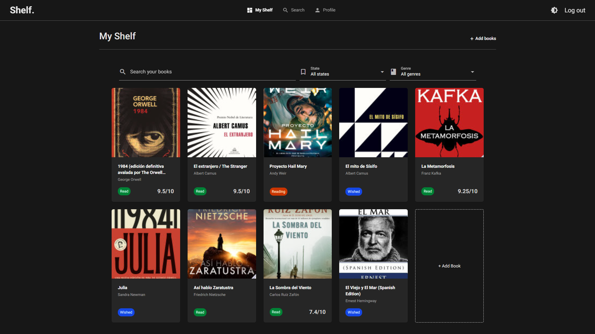
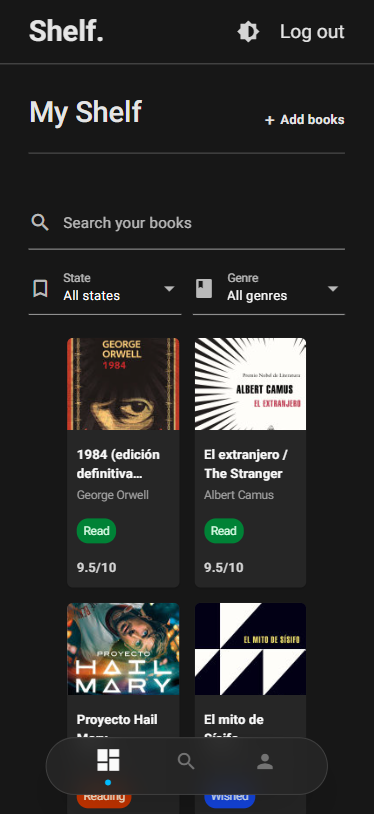

# 📚 Shelf.

**An app for book lovers — search, shelve, follow, and discover.**

Shelf is a Python web app built with [NiceGUI](https://nicegui.io/) for tracking what you read: search books via the Google Books API, keep a personal library, follow other readers, discover trending/wished-for titles, and manage your account.


[](https://shelf-mymi.onrender.com/)

[](LICENSE)

> ⚠️ **Under active development.** Structure and features may change without notice.

---

## Table of contents

- [Features](#features)
- [Demo](#demo)
- [Tech stack](#tech-stack)
- [Project structure](#project-structure)
- [Installation](#installation)
- [Configuration](#configuration)
- [Usage](#usage)
- [Roadmap](#roadmap)
- [License](#license)

---

## Features

- **Unified search** — search books and users from a single search UI.
- **"My shelf"** — save books to your shelf; add notes, start and end date, ratings and other relevant info. Track your books!
- **Top Shelf & Most Wished** — highlight your top-shelved books and the most-wished titles for others to see.
- **Social network** — follow other users, discover their profile, and search/filter in the network UI.
- **Account & privacy settings** — dedicated settings page for account details and privacy controls.
- **Reading stats** — yearly totals, average rating, genre breakdown, and a reading activity heatmap.
- **Auth & profile** — login and a personal profile page.
- **Light & dark mode** — toggle between light and dark themes from the header; your preference is remembered between sessions.
- **Multi-language UI** — switch between English and Spanish from the header; your choice is remembered for the session.

> Not every feature is fully polished yet — this is a work in progress.

## Demo

https://github.com/user-attachments/assets/edd1b943-6737-4f73-b62d-133cd0a7378e

> Try out the demo app: [shelf on Render](https://shelf-mymi.onrender.com)

<br>

<p align="center">
  
  <br>
  <em>Dark mode</em>
</p>

<p align="center">
  
  <br>
  <em>Mobile</em>
</p>

## Tech stack

| Category      | Technology                                                        |
| ------------- | -------------------------------------------------------------     |
| Language      | Python 3.10+                                                      |
| UI            | [NiceGUI](https://nicegui.io/) (FastAPI + Vue under the hood)     |
| Database      | SQLAlchemy ORM (PostgreSQL vía [Supabase](https://supabase.com/)) |
| Hosting       | [Render](https://render.com/)                                     |
| External data | Google Books API                                                  |
| Charts        | ECharts                                                           |
| Localization  | Custom JSON-based i18n (English default, Spanish)                 |
| Testing       | Pytest                                                            |

## Project structure

```
shelf/
├── core/                # Config, DB setup
├── data/                 # SQLite database
├── locales/               # Translation dictionaries (en.json, es.json)
├── models/                 # SQLAlchemy models
├── services/                # auth, catalog, library, network, stats, i18n
├── static/                 # Static assets
├── tests/
│   ├── models/
│   └── services/             # Tests per service (incl. i18n)
├── views/
│   ├── components/            # books, shelf, network, profile, settings, stats...
│   ├── pages/                   # login, my_shelf, search, profile, settings
│   └── i18n.py                   # `_()` translation helper + language switcher
│   └── theme.py                   # theme regarding functions
├── main.py
├── pyproject.toml
├── requirements.txt
└── .env.example
```

## Installation

```bash
git clone https://github.com/angelrbl/shelf.git
cd shelf
python -m venv .venv && source .venv/bin/activate  # Windows: .venv\Scripts\activate
pip install -r requirements.txt
```

You'll also need a [Google Books API key](https://developers.google.com/books/docs/v1/using#APIKey).

## Configuration

```bash
cp .env.example .env
```

```env
GOOGLE_BOOKS_API_KEY=your_api_key_here
DATABASE_URL=sqlite:///shelf.db
STORAGE_SECRET=your_storage_key_here
```

## Usage

```bash
python main.py
```

## Roadmap

- [ ] Expand and polish the recommendation engine
- [x] Richer stats & dashboards
- [x] Deploy Shelf on the web
- [x] Multiple language support (en/es)
- [x] UI tweaks and appearance; dark mode

## License

This project is licensed under the MIT License — see the [LICENSE](LICENSE) file for details.

---

<div align="center">
Built by <a href="https://github.com/angelrbl">@angelrbl</a>
</div>
